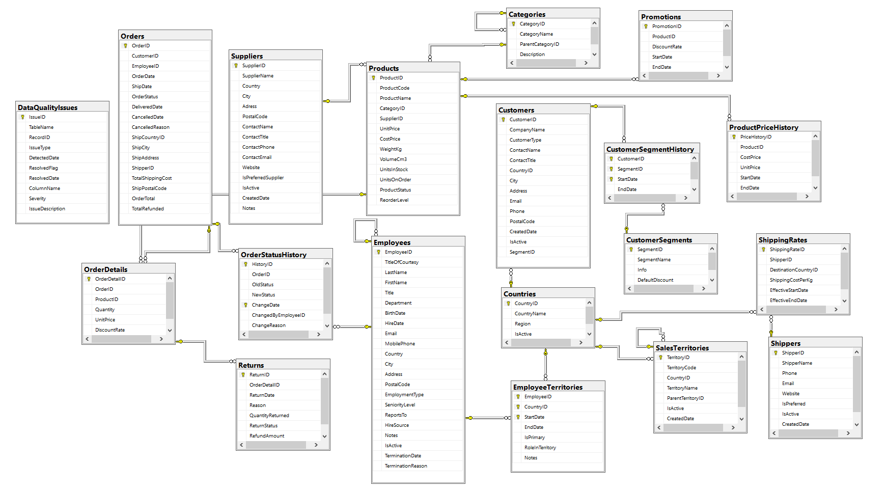
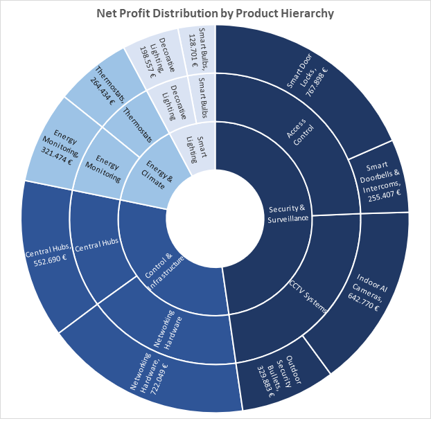
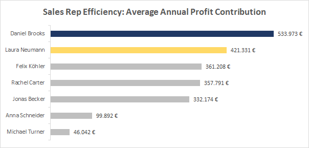
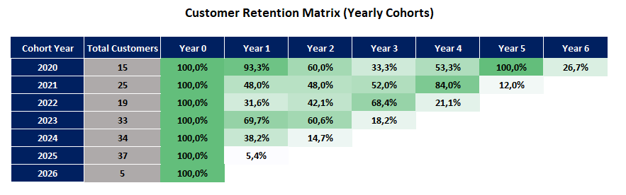
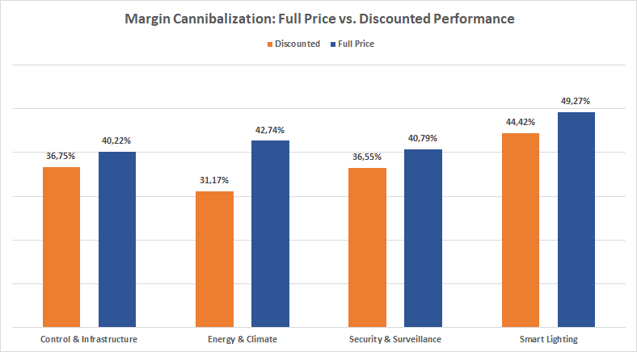

# 🏢 RheinTrade Solutions: Enterprise ERP & Advanced Business Analytics

## 📌 Executive Summary
**RheinTrade Solutions** is a highly sophisticated, simulated B2B/B2C smart home and IoT infrastructure distributor. This project serves as a comprehensive **Data Engineering and Business Intelligence** portfolio piece. 

Unlike standard static datasets, this repository features a fully functional **Mini-ERP relational database** with strict data integrity, historical tracking, and event-driven automated business logic. The analytical queries leverage advanced SQL concepts to solve complex, real-world business problems such as margin cannibalization, cross-selling opportunities, and long-term cohort retention.

---

## ⚙️ Database Architecture & Key Technical Implementations
The foundation of this project is a robust custom database (`RheinTradeSolutions.sql`) consisting of 17 interrelated tables and **13 advanced automated triggers** acting as an event-driven state machine.

**Core Engineering Highlights:**
* **Temporal Data & SCD (Slowly Changing Dimensions) Logic:** Utilizes history tables (`ProductPriceHistory`, `CustomerSegmentHistory`, `OrderStatusHistory`) to preserve historical accuracy. This ensures financial reports reflect the exact pricing and discount segments active at the time of purchase, preventing data mutation errors.
* **Event-Driven Financials & Logistics (Trigger Architecture):** * `TRG_OrderDetails_FetchPrice`: Dynamically fetches the correct historical unit price upon insertion and automatically resolves compounded discount rates by evaluating concurrent `Promotions` and active `CustomerSegments`.
  * `TRG_UpdateOrderTotal` & `TRG_Orders_MinShippingCost`: Executes dynamic logistics cost calculations based on product weight (`WeightKg`), destination country, and specific shipper rate tables, automatically updating the final order total.
  * `TRG_Returns_FinalLogic`: Automates the reverse-logistics pipeline by returning items to inventory, calculating precise refund amounts based on historical purchase prices, and smartly routing the main order status to either 'Returned' or 'Partially Returned'.
* **Automated Inventory Lifecycle:** `TRG_Orders_StockMovementManager` and `TRG_OrderDetails_UpdateReservation` strictly manage physical stock levels, seamlessly transitioning units between `UnitsInStock` and `UnitsOnOrder` (reserved) based on real-time order states.
* **Strict State Machine Integrity:** Enforced via Foreign Keys, Check Constraints, and transition triggers (`TRG_Orders_StatusTransitionRules`) to prohibit illogical business flows (e.g., reverting a 'Delivered' order back to 'Pending', or accepting a product return before its official delivery date).
* **Automated Data Governance & Quality Auditing:** Implements comprehensive Stored Procedures (e.g., `SP_Audit_Full_System_Quality`) as an active monitoring layer. This system continuously scans for and logs business anomalies into a dedicated `DataQualityIssues` table—detecting complex issues like fuzzy-duplicate B2B customers, negative inventory states, and logical timeline errors (e.g., items delivered before being ordered).

## 🏗️ Database Architecture & Design

*The system is built on a relational architecture featuring 19 interrelated tables, ensuring high data integrity and complex event tracking.*
---

## 📊 Analytical Deep Dives & Business Insights

### 1. Hierarchical Net Profitability (Returns Adjusted)
* **Objective:** Calculate the true bottom line across a 3-tier product hierarchy by rigorously deducting product returns and exact refunded amounts.
* **Insight:** *Security & Surveillance* is the core revenue engine (€5.0M+), while *Smart Bulbs* generate the highest individual ROI with a 53.91% profit margin.
### 📊 Executive Summary: Main Category Profitability
| Main Category | Net Units Sold | True Net Revenue | True Net Profit | Profit Margin |
| :--- | :--- | :--- | :--- | :--- |
| **Security & Surveillance** | 30,215 | 5.006.145 € | 1.995.958 € | **39.87%** |
| **Control & Infrastructure** | 26,024 | 3.258.597 € | 1.274.738 € | **39.12%** |
| **Energy & Climate** | 15,605 | 1.464.772 € | 585.907 € | **40.00%** |
| **Smart Lighting** | 14,059 | 669.221 € | 327.257 € | **48.90%** |

* 📁 [View SQL Query](scripts/Analysis_1_Net_Profit_Distribution.sql) | 🧠 [Read Deep-Dive Methodology](docs/Comprehensive_Analysis.md#analysis-1)

* 

### 2. Year-over-Year (YoY) Revenue Growth Trends
* **Objective:** Track historical revenue trends using Window Functions (`LAG()`, `OVER()`) to identify the fastest-growing business units.
* **Insight:** *Smart Lighting* and *Security & Surveillance* marked a massive comeback in 2025, with YoY growth exceeding 255% and 223% respectively.
### 📈 Growth Summary: 2024 vs. 2025 (Top Performers)
| Main Category | 2024 Revenue | 2025 Revenue | YoY Growth |
| :--- | :--- | :--- | :--- |
| **Smart Lighting** | 120.320 € | 427.166 € | **+255.02%** 🚀 |
| **Security & Surveillance**| 728.514 € | 2.354.071 € | **+223.13%** 🚀 |
| **Control & Infrastructure**| 530.302 € | 1.248.028 € | **+135.34%** |

* 📁 [View SQL Query](scripts/Analysis_2_Revenue_Growth_Trends.sql) | 🧠 [Read Deep-Dive Methodology](docs/Comprehensive_Analysis.md#analysis-2)

* RevenueGrowthTrends.png)

### 3. Top "Whale" Customers Segmentation & Tenure
* **Objective:** Identify the most valuable B2B customers based on true Lifetime Value (LTV) and map them against their tenure and strategic VIP segments.
* **Insight:** Platinum accounts like *Chicago Smart Office Inc.* dominate revenue generation (€440K+ LTV). Discovered highly profitable platinum accounts lacking official "Strategic Partner" segmentation, representing an immediate opportunity for account management to secure long-term loyalty.
### 🐋 Top Strategic "Whale" Customers

| Company Name | Region | Tenure (Days) | Total Orders | Current Segment | Lifetime Value |
| :--- | :--- | :--- | :--- | :--- | :--- |
| **Chicago Smart Office Inc.** | North America | 2,009 | 23 | B2B - Strategic Partner | **440.891 €** |
| **Berlin Smart Hotel Group** | Europe | 2,252 | 20 | B2B - Strategic Partner | **368.572 €** |
| **NYC Secure Living** | North America | 1,850 | 18 | B2B - Strategic Partner | **348.051 €** |
| **Boston Smart Campus** | North America | 893 | 8 | *No Segment* ⚠️ | **317.163 €** |
| **Toronto Condo Security** | North America | 949 | 13 | B2B - Corporate | **312.884 €** |
| **Stuttgart Auto-Smart** | Europe | 1,865 | 15 | B2B - Corporate | **310.488 €** |
| **Vancouver Smart Access Ltd**| North America | 639 | 4 | *No Segment* ⚠️ | **278.543 €** |

*(Note: "No Segment" accounts in the top tier represent an immediate risk of churn and must be transitioned to Strategic Partners.)*

* 📁 [View SQL Query](scripts/Analysis_3_Top_Whale_Customers.sql) | 🧠 [Read Deep-Dive Methodology](docs/Comprehensive_Analysis.md#analysis-3)

### 4. Employee Efficiency & Territorial Performance
* **Objective:** Rank the sales force not just by total volume, but by *Annualized Net Profit*, tenure, and primary territory.
* **Insight:** Uncovered a rising star Junior Rep (Laura Neumann) drastically outperforming senior staff in the Netherlands with €169K+ annual profit, while highlighting Senior reps (Daniel Brooks) who successfully protect margins (42.00%) during enterprise negotiations.
### 🏆 Top 3 Sales Performers (By Annual Profit)
| Rank | Employee Name | Seniority | Primary Territory | Avg. Annual Profit | Profit Margin |
| :---: | :--- | :--- | :--- | :--- | :--- |
| 🥇 | **Daniel Brooks** | Senior | Canada | **224.269 €** | 42.00% |
| 🥈 | **Laura Neumann** | Junior | Netherlands | **169.851 €** | 40.31% |
| 🥉 | **Felix Köhler** | Senior | France | **154.853 €** | 42.87% |

* 📁 [View SQL Query](scripts/Analysis_4_Sales_Rep_Efficiency.sql) | 🧠 [Read Deep-Dive Methodology](docs/Comprehensive_Analysis.md#analysis-4)

* 

### 5. Supplier Reliability & Profitability Matrix
* **Objective:** Cross-reference supplier profitability with product return rates to audit the "Preferred Supplier" classification.
* **Insight:** Flagged a "Preferred" sensor supplier (*Munich Sensor Works*) with a critical 4.10% defect rate while identifying non-preferred suppliers (*Toronto Energy Tech*, *Anatolia Smart Glass*) providing near zero-defect, high-margin products that warrant contract upgrades.
### 🏭 Supplier Reliability & Profitability Audit
| Supplier Name | Country | Preferred Status | Total Units Sold | Return Rate | Net Profit |
| :--- | :--- | :--- | :--- | :--- | :--- |
| **Warsaw AI Solutions** | Poland | Yes (Preferred) | 6,850 | **0.00%** 🌟 | **€592,912** |
| **Munich Sensor Works** | Germany | Yes (Preferred) | 4,210 | **4.10%** 🚨 | **€41,760** |
| **Toronto Energy Tech** | Canada | No | 3,100 | **0.13%** 🌟 | **€275,230** |
| **Anatolia Smart Glass** | Turkey | No | 2,850 | **0.07%** 🌟 | **€220,840** |

*(Note: Suppliers flagged with 🚨 require immediate quality control audits. High-performing non-preferred suppliers should be considered for contract upgrades.)*

* 📁 [View SQL Query](scripts/Analysis_5_Supplier_Reliability_Profitability.sql) | 🧠 [Read Deep-Dive Methodology](docs/Comprehensive_Analysis.md#analysis-5)

### 6. Market Basket Analysis (Cross-Selling Opportunities)
* **Objective:** Identify the most frequent product pairings within single transactions using `SELF-JOIN` logic to optimize bundling strategies.
* **Insight:** Discovered that *BioEntry Pro Fingerprint Locks* act as the primary "anchor" product, frequently bought alongside outdoor cameras and central hubs (*OmniConnect Hub*), justifying the creation of a new "Enterprise Security Bundle."
### 🛒 Frequent Itemset & Cross-Selling (Top Pairings)

| Primary Item (Anchor) | | Secondary Item (Cross-Sell) | Frequency | Category Bridge |
| :--- | :---: | :--- | :---: | :--- |
| **Whole Home Energy Monitor (CT)** | ➕ | **DIN-Rail Smart Energy Meter** | 26 | Intra-Category (Energy Monitoring) |
| **GigaMesh IoT Router 6E** | ➕ | **SmartSwitch 24-Port Managed** | 25 | Intra-Category (Networking Hardware) |
| **BioEntry Pro Fingerprint Lock** | ➕ | **KeyPad Secure Deadbolt** | 24 | Intra-Category (Smart Door Locks) |
| **VisionAI Indoor 360 Cam** | ➕ | **Guardian 4K Outdoor Bullet** | 21 | Cross-Category (Indoor ➡️ Outdoor) |
| **AeroStat Precision Control V1** | ➕ | **EcoTemp Smart Thermostat** | 19 | Intra-Category (Thermostats) |
| **Guardian 4K Outdoor Bullet** | ➕ | **BioEntry Pro Fingerprint Lock** | 18 | Cross-Category (Cameras ➡️ Locks) |
| **SmartSwitch 8-Port Desktop** | ➕ | **SmartSwitch 24-Port Managed** | 17 | Intra-Category (Networking Hardware) |

*(Insight: Security devices like the Guardian 4K Bullet and BioEntry Lock frequently act as cross-selling bridges between different product categories, strongly justifying the creation of an "Enterprise Security Bundle" to boost average order value.)*

* 📁 [View SQL Query](scripts/Analysis_6_Cross_Selling_Opportunities.sql) | 🧠 [Read Deep-Dive Methodology](docs/Comprehensive_Analysis.md#analysis-6)

### 7. Customer Cohort Analysis (Yearly Retention Matrix)
* **Objective:** Measure long-term customer loyalty by pivoting data to track the purchasing lifecycle of different yearly acquisition cohorts.
* **Insight:** Revealed a critical 5-year "Hardware Refresh Cycle" among foundational B2B clients (100% return rate in Year 5), while exposing a general "Year 2 drop-off" that suggests the urgent need for introducing SaaS/Subscription service models.
* 📁 [View SQL Query](scripts/Analysis_7_Customer_Retention_Matrix.sql) | 🧠 [Read Deep-Dive Methodology](docs/Comprehensive_Analysis.md#analysis-7)

* 

### 8. Discount Impact & Margin Cannibalization
* **Objective:** Assess whether applied discounts actually drive sufficient volume to offset the reduction in profit margins.
* **Insight:** Identified severe margin cannibalization in the *Energy & Climate* category (an 11.5% margin drop for negligible volume gain). Conversely, *Smart Lighting* proved highly inelastic, generating 49.27% margins at full price, prompting a recommendation to restructure pricing strategies immediately.
### ⚠️ Margin Cannibalization Alert (Key Categories)
| Main Category | Full Price Margin | Discounted Margin | Margin Drop (Impact) |
| :--- | :--- | :--- | :--- |
| **Energy & Climate** | 42.74% | 31.17% | **-11.57%** 🚨 (Severe Cannibalization) |
| **Smart Lighting** | 49.27% | 44.42% | **-4.85%** ✅ (Highly Inelastic) |

* 📁 [View SQL Query](scripts/Analysis_8_Margin_Cannibalization.sql) | 🧠 [Read Deep-Dive Methodology](docs/Comprehensive_Analysis.md#analysis-8)

* 

---

## 🚀 How to Use This Repository
1. Clone the repository to your local machine.
2. The `Database_Creation/` folder contains the `RheinTradeSolutions.sql` script to instantly generate the entire database architecture, mock data, and triggers in SQL Server.
3. The `Analytical_Queries/` folder contains all the documented SQL scripts categorized by business domain (e.g., Sales, HR, Logistics, Procurement).
4. 📑 For a detailed breakdown of the business insights, strategic actionable recommendations, and the "story behind the numbers" for each analytical query, please refer to the [Comprehensive Business Insights Report](docs/Comprehensive_Analysis.md).
---
*Developed as a comprehensive showcase of Advanced SQL, Data Engineering, and Business Intelligence capabilities.*
